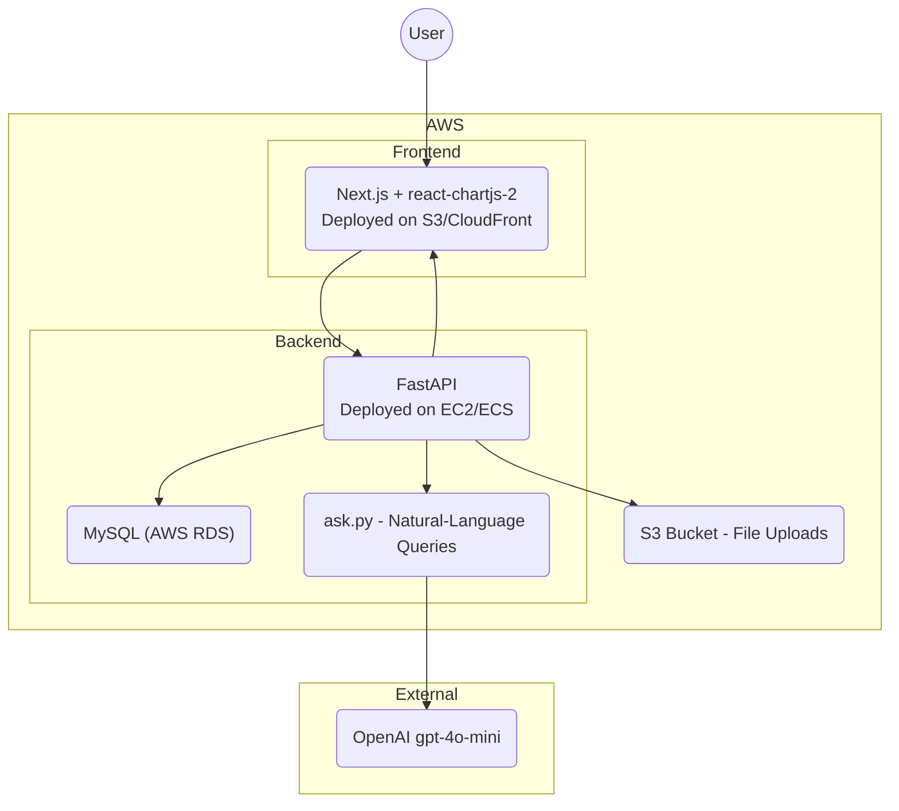

# AWS Cost Analyzer

[](LICENSE)
[] [] []

## Overview

AWS Cost Analyzer lets you upload billing reports (CSV / Excel), store and aggregate costs in a local MySQL database, then ask natural-language questions to gain insights and optimization suggestions using OpenAI's **gpt-4o-mini**.

## Tech Stack

- **Backend**: Python 3.10+, FastAPI, Uvicorn, Pandas
- **Database**: MySQL 8+
- **Frontend**: Next.js (React), Tailwind CSS
- **LLM**: OpenAI `gpt-4o-mini` (override via `OPENAI_MODEL` env var)
- **Charts**: Chart.js, react-chartjs-2

## Architecture



## Features

- CSV and Excel (`xls`, `xlsx`) upload & parsing
- Raw (`cost_data`) and aggregated (`cost_summary`) storage
- Natural-language Q&A → SQL → summarization
- Interactive cost breakdown charts

## Installation

```bash
git clone https://github.com/aniketkarne/AI-aws-cloud-cost-analyzer.git
cd AI-aws-cloud-cost-analyzer
```

Backend:

```bash
cd backend
python3 -m venv venv
source venv/bin/activate
pip install -r requirements.txt
cp ../.env.example .env   # then edit .env with your OPENAI_API_KEY and MySQL creds
```

Frontend:

```bash
cd ../frontend
npm install
```

## Usage

Start Backend (from the `backend/` directory):

```bash
uvicorn backend.main:app --reload --host 0.0.0.0 --port 8000
# or, equivalently:
python main.py
```

Start Frontend (from the `frontend/` directory):

```bash
npm run dev
```

Open <http://localhost:3000>.

## Configuration

Required environment variables (see `.env.example`):

- `OPENAI_API_KEY` — your OpenAI API key
- `OPENAI_MODEL` — (optional) defaults to `gpt-4o-mini`
- `DB_HOST`, `DB_PORT`, `DB_USER`, `DB_PASS`, `DB_NAME` — MySQL connection

The backend auto-creates the `aws_costs` database and the `cost_data` /
`cost_summary` tables on first start.

## Project Structure

```
.
├── backend
│   ├── main.py             # FastAPI app + startup hooks
│   ├── db.py               # MySQL connection + schema bootstrap
│   ├── routes
│   │   ├── upload.py       # POST /upload
│   │   └── ask.py          # POST /ask (NL → SQL → answer)
│   └── requirements.txt
├── frontend
│   ├── pages
│   │   ├── index.tsx
│   │   ├── upload.tsx
│   │   └── ask.tsx
│   ├── components
│   │   └── CostChart.tsx
│   ├── styles
│   │   └── globals.css
│   ├── tailwind.config.js
│   └── package.json
├── .env.example
├── .gitignore
├── LICENSE
└── README.md
```

## Contributing

Contributions are welcome. Please open issues or submit pull requests.

## License

[MIT](LICENSE)